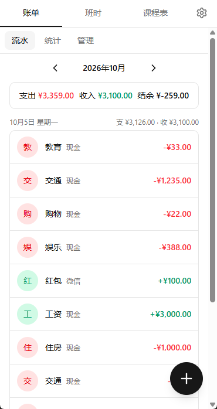
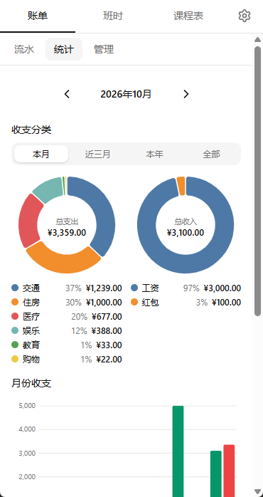
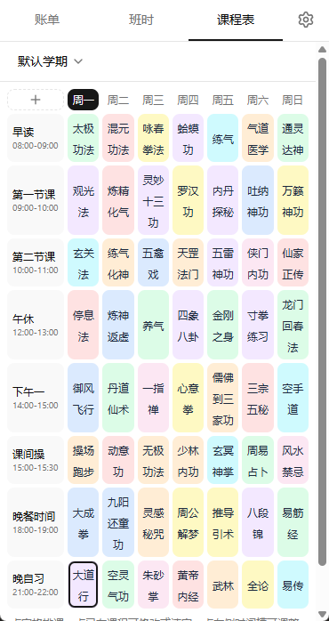
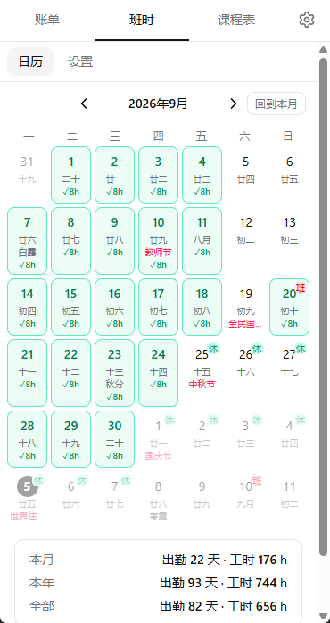

# Recorder




> 开发文档：
> - [开发链路](docs/开发链路.md) —— 环境搭建 → 开发 → 模拟器调试与自动化验证 → 打包发布的完整链路实录
> - [链路验证笔记](docs/链路验证笔记.md) —— Tauri 权限、构建环境、雷电模拟器的坑与对策

## 功能说明

- 账单
  - **流水页**：月份切换、当月收/支/结余汇总、按日分组列表（含转账记录）；右下 FAB 记一笔
  - **记一笔**：支出/收入/转账三模式；金额（元→分整数存储）、分类网格、账户、日期、备注；点已有记录可编辑/删除
  - **统计页**：d3 绘制——本月支出分类环形图、近 6 个月收支分组柱状图、近 30 天支出趋势折线
  - **管理页**：账户（新增时可设初始金额，实时余额 = 初始金额 + 流入 − 流出 ± 转账、改名、归档）、分类
- 班时
  - **月历**：公历 + 农历；农历日/公历农历节日/节气/纪念日；法定班/休角标；今天高亮
  - **记班**：点未标记日 = 上班；点已标记日 = 详情（改工时/备注/取消上班）
  - **工时设置**：每天工时；保存 = 插入生效日期为今天的新设置行，过去的记录仍按当时设置快照
  - **三段统计**：本月/本年/全部各自的出勤天数、总工时
  - **自定义节日**：名称 + 农历/公历 + 月日（如「母亲生日 农历八月十三」），日历格子内独立一行显示
- 课程表
  - **多学期**：新建/切换/重命名/删除，当前学期记忆
  - **时间槽**：把一天划分为若干段；左上角 + 新增，按开始时间自动排序，时间段冲突（区间重叠）拒绝保存、首尾相接允许
  - **周网格**：行 = 时间槽，列 = 周一~周日；一屏放下七天不限最小宽度，长名称自动撑高行高，窄屏建议横屏；点空格排课，点已有课编辑/清空
  - **当前高亮**：每分钟刷新，今天列 × 当前时间落入的槽位格描边高亮
- 设置页
  - **导出备份**：全量数据 → JSON 文件（Android 走系统 SAF 保存框，Windows 走系统另存为）
  - **导入备份**：选 JSON → 校验格式 → 确认框 → **全量替换** → 前端重载

## 技术栈

- Tauri v2（Rust 后端 + 系统 WebView）
- React 18 + TypeScript + Vite
- tailwindcss v4（`@tailwindcss/vite`）+ shadcn 风格组件（手入驻 `src/components/ui/`，非 CLI）+ Radix + lucide-react
- zustand（按模块分 store）、d3（统计图）、lunar-javascript（农历/节气/节日/法定班休）
- SQLite（tauri-plugin-sql，sqlx 驱动）

## 开发环境

| 依赖 | 版本 | 说明 |
|---|---|---|
| Node.js | ≥ 20 | 国内建议 `npm i --registry=https://registry.npmmirror.com`（官方源可能卡死） |
| Rust | ≥ 1.90 | 含 `aarch64/armv7/i686/x86_64-linux-android` 四个 target |
| JDK | 17 | 设 `JAVA_HOME`（Gradle 不支持更高版本） |
| Android SDK | Platform 36 + Build-Tools 36.1.0 + NDK 29 + Platform-Tools | 仅需 cmdline-tools，无需 Android Studio IDE |
| 环境变量 | `ANDROID_HOME`、`JAVA_HOME` | 用户级已配置 |

模拟器调试（雷电，Android 14 / x86_64）：

```bash
# 雷电设置里开启 ADB 连接后，用 SDK 的 adb（不要用雷电自带的，版本冲突）
adb connect 127.0.0.1:5555
# 若同时出现 emulator-5554 和 127.0.0.1:5555 两个条目（同一设备），去重：
adb disconnect 127.0.0.1:5555
```

## 常用命令

```bash
npm run dev                  # 仅前端（浏览器预览，无数据库）
npm run tauri dev            # Windows 开发模式
npm run android:dev          # Android 开发模式（需设备在线，首次构建约 20 分钟）
```

> 克隆仓库或删掉 `src-tauri/gen/android` 后，先执行一次 `npm run android:init`（= `tauri android init` + 自动打本机补丁）。

## 打包

```bash
npm run android:build -- --apk   # Android 签名 APK（universal 全架构）
npm run tauri build              # Windows 安装包（NSIS + MSI）
```

产物位置：

- APK：`/src-tauri/gen/android/app/build/outputs/apk/universal/release/app-universal-release.apk`
- 安装包：`/src-tauri/target/release/bundle/nsis/recorder_*_x64-setup.exe`、`bundle/msi/*.msi`

**Android 签名**：overlay 里的 `app/build.gradle.kts` 配了 `signingConfigs.release`，读 `app/recorder-release.keystore`（本地生成的个人签名，已 gitignore，有效期 30 年）；密码默认 `recorder-local`，可用环境变量 `RECORDER_STORE_PASSWORD` / `RECORDER_KEY_PASSWORD` 覆盖。换机器构建需重新生成 keystore（`keytool -genkeypair`），否则与已安装应用签名不一致会导致无法覆盖安装。

**gen/android 不纳入版本库**：约 1600 行模板 Kotlin/gradle + 图标由 `tauri android init` 生成，已 gitignore。本机补丁集中在 `src-tauri/android-overlay/`（9 个文件整文件覆盖），`android:init` / `android:dev` / `android:build` 都会自动应用，**不再需要手动重打**：

1. `app/build.gradle.kts`：签名配置（见上）
2. `app/src/main/AndroidManifest.xml`：`android:windowSoftInputMode="adjustResize"`（辅助；主修复在 MainActivity）
3. `app/src/main/java/com/recorder/app/MainActivity.kt`：不调 `enableEdgeToEdge()`；改为在 WebView 上 `setOnApplyWindowInsetsListener` **消费**系统 insets——状态栏/导航栏/键盘高度转成 WebView 的 margin，视口永远夹在安全区内
4. `app/src/main/res/values/themes.xml` + `values-night/themes.xml`：状态栏/导航栏白底深色图标
5. `build.gradle.kts` + `buildSrc/build.gradle.kts`：阿里云 maven 镜像（中央仓库 TLS 被拦截）
6. `gradle.properties`：`kotlin.incremental=false`（跨盘符增量编译崩溃）
7. `buildSrc/.../BuildTask.kt`：Windows 下 npm 经 cmd.exe 执行

> 注意：overlay 是**整文件覆盖**。Tauri 大版本升级后若模板有更新，会被 overlay 盖回旧版，升级后需人工比对一次这 9 个文件。

> 为什么不用 edge-to-edge + `env(safe-area-inset-*)` 的前端方案：① Radix 弹窗打开时 react-remove-scroll-bar 会清零 body 的 padding-top，界面被顶到状态栏下（为此安全区 padding 已挪到 #root 作防御）；② 部分 ROM/老 WebView 的 `env(safe-area-inset-bottom)` 恒为 0（实测 vivo S9，FAB 被三大金刚遮挡）；③ edge-to-edge 下 `adjustResize` 键盘收缩行为因 ROM 而异。原生层消费 insets 后三个问题同时解决，前端 env() 全为 0，CSS 无需感知设备差异。

## 数据存储位置

- Windows：`%APPDATA%\com.recorder.app\recorder.db`
- Android：应用私有目录（无需存储权限）
- 注意：sqlx 默认 **WAL 模式**，写入先落在 `recorder.db-wal`，主文件大小不会立即增长，属正常现象

## 调试技巧

- **Android WebView 远程调试**：debug 包暴露 `webview_devtools_remote_<pid>` socket，`adb forward tcp:9222 localabstract:<socket>` 后即可用 CDP（Chrome DevTools Protocol）驱动页面——比模拟器盲点坐标可靠得多（雷电会吞/重放触摸事件）
- **Windows WebView2 远程调试**：设 `WEBVIEW2_ADDITIONAL_BROWSER_ARGUMENTS="--remote-debugging-port=9229"` 再 `npm run tauri dev`
